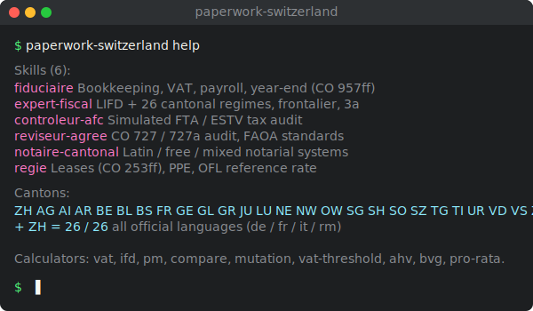

<sub>🌐 [English](./README.md) · [Français](./README.fr.md) · **Deutsch** · [Italiano](./README.it.md)</sub>




<h1 align="center">Paperwork Switzerland 🇨🇭</h1>

<p align="center">
  <b>KI-Agenten-Skills für die Schweizer Bürokratie — alle 26 Kantone.</b>
</p>

<p align="center">
  <i>Weil jemand das Papierkram machen musste, und der jemand keine Kaffeepause braucht.</i>
</p>

Inspiriert von [`romainsimon/paperasse`](https://github.com/romainsimon/paperasse) (FR) — gleiche Struktur, Schweizer Inhalt: drei Steuerebenen (Bund, Kantone, Gemeinden), vier Amtssprachen, 26 kantonale Regimes.

---

## Was ist das?

**Paperwork Switzerland ist eine Sammlung von Skills für KI-Agenten** ([Claude Code](https://claude.com/product/claude-code), [Codex](https://openai.com/codex/), [Cursor](https://cursor.com), [Windsurf](https://windsurf.com), [Cline](https://cline.bot), [Aider](https://aider.chat)) spezialisiert auf Schweizer Buchhaltung, Steuern, Revision, Notariat und Liegenschaftsverwaltung.

Jeder Skill verwandelt deinen Agenten in einen Experten-Copiloten: Buchhaltung (OR 957ff, KMU-Kontenplan, MwSt, Jahresabschluss), Bundes- und Kantonssteuern (DBG, 26 Regimes, Quellensteuer, Grenzgänger), ESTV-Prüfung, Revision (OR 727 / 727a, RAB), kantonales Notariat (lateinisch / frei / gemischt), Liegenschaftsverwaltung (OR 253ff, Stockwerkeigentum).

Die Skills sind Markdown. Das Repo enthält auch Bankkonnektoren (**bexio**, **PostFinance** via ISO 20022) und Zahlungen (**Stripe**), Swiss QR-Bill-Generation und deterministische Rechner für MwSt, DBST und kantonale Gewinnsteuer.

---

## Schnellinstallation

### Option 1 — Agent installiert

```
Installiere alle Skills von https://github.com/0xjustBen/paperwork-switzerland
Starte dann das Setup für meine Schweizer Bürokratie
```

### Option 2 — Manuell

```bash
git clone https://github.com/0xjustBen/paperwork-switzerland.git
cd paperwork-switzerland
cp -r fiduciaire expert-fiscal controleur-afc reviseur-agree notaire-cantonal regie ~/.claude/skills/
npm install
uv sync --project evals
```

---

## Die 6 Skills

| Skill | Rolle | Was er macht |
|-------|-------|--------------|
| **`fiduciaire`** | Treuhänder | KMU-Buchhaltung, MwSt (8.1/2.6/3.8 %), Lohn + AHV/BVG, Jahresabschluss (OR 957ff) |
| **`expert-fiscal`** | Steuerexperte | NP & JP, DBST + 26 Kantonssteuern, Vermögen, Eigenmietwert, Säule 3a, Grenzgänger |
| **`controleur-afc`** | ESTV-Prüfer | Simulation ESTV-/kantonale Prüfung auf 6 Achsen |
| **`reviseur-agree`** | Zugelassener Revisor | Ordentlich (OR 727) / eingeschränkt (OR 727a), RAB-Standards, OR 725 |
| **`notaire-cantonal`** | Kantonaler Notar | Notariatssystem pro Kanton — Immobilien, Erbrecht, Gesellschaften |
| **`regie`** | Liegenschaftsverwalter | Mietrecht (OR 253–274g), Stockwerkeigentum (ZGB 712a ff), BWO-Referenzzinssatz |

4 Sprachen pro Skill: `SKILL.md` (Englisch, Standard), `SKILL.fr.md`, `SKILL.de.md`, `SKILL.it.md`.

---

## Beispiele

```
> Hier meine bexio-Transaktionen für Q4. Kategorisiere und buche.
> Jahresabschluss meiner Zürcher AG für 2026.
> Vergleiche die Gewinnsteuerbelastung in ZG vs GE bei CHF 500'000.
> Ich bin französischer Grenzgänger in Genf. Quellensteuerpflicht?
> Amtliches Mietzinserhöhungsformular Lausanne, Referenzzinssatz auf 1.75 % gestiegen.
> Chalet-Kauf in Verbier. Notarkosten und Handänderungssteuer im Wallis?
```

---

## Kantonsdaten

[`data/cantons/`](./data/cantons) — eine JSON-Datei pro Kanton, Schema in [`_schema.json`](./data/cantons/_schema.json).

## Deterministische Rechner

```bash
node scripts/calc.js vat --net 1000 --rate normal
node scripts/calc.js ifd --profit 500000
node scripts/calc.js pm --canton ZG --profit 500000
```

## Integrationen

| Konnektor | Beschreibung | Env |
|-----------|--------------|-----|
| [bexio](integrations/bexio) | Schweizer KMU-Buchhaltung | `BEXIO_API_TOKEN` |
| [Stripe](integrations/stripe) | Zahlungen | `STRIPE_SECRET` |
| [PostFinance](integrations/postfinance) | ISO 20022 camt.053 Parser | — |

## Evaluationen

LLM-as-judge-Framework nach `romainsimon/paperasse`. Fälle pro Skill in `<skill>/evals/evals.json`.

```bash
uv run --project evals python evals/run_evals.py
```

---

## ⚠️ Haftungsausschluss

Hilfsmittel. Ersetzen keinen diplomierten Treuhänder, Steuerexperten, RAB-Revisor, Notar oder Anwalt. Mit offiziellen Quellen verifizieren (ESTV, BAZG, Kantone).

## Quellen

- [ESTV](https://www.estv.admin.ch) · [Fedlex](https://www.fedlex.admin.ch) · [SSK](https://www.steuerkonferenz.ch) · [RAB](https://www.rab-asr.ch) · [Notarenverband](https://www.notaires.ch) · [BWO](https://www.bwo.admin.ch)


<!-- TODO: translate "Usage with AI agents" + "Eval methodology" sections from README.md -->
